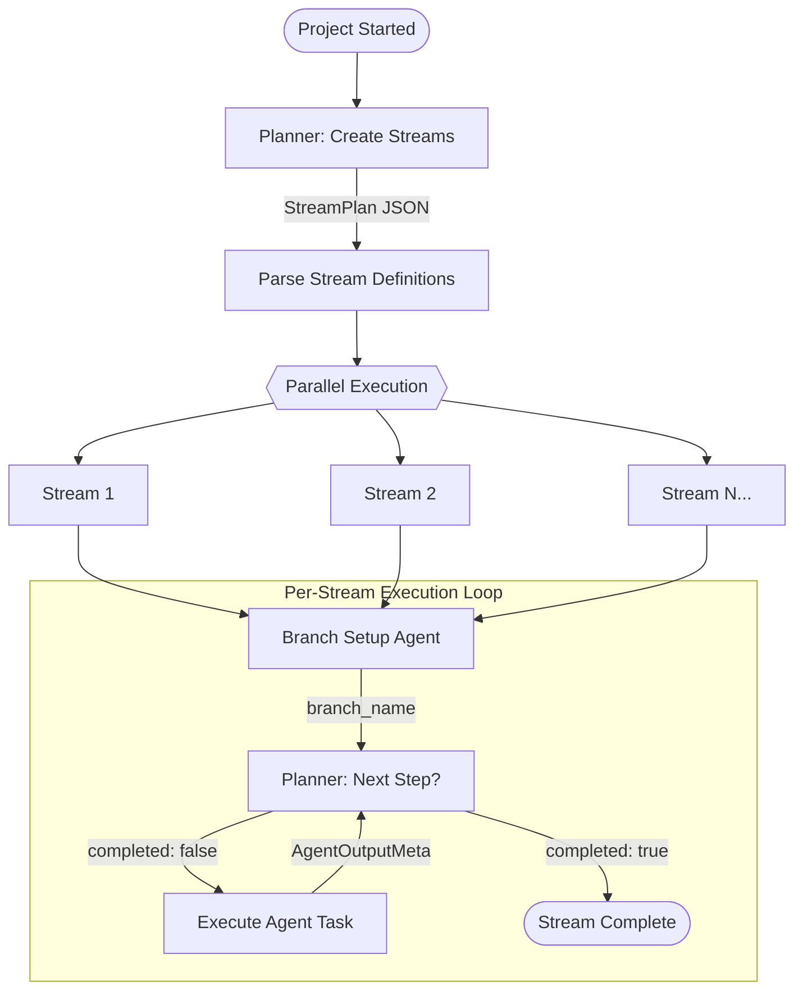
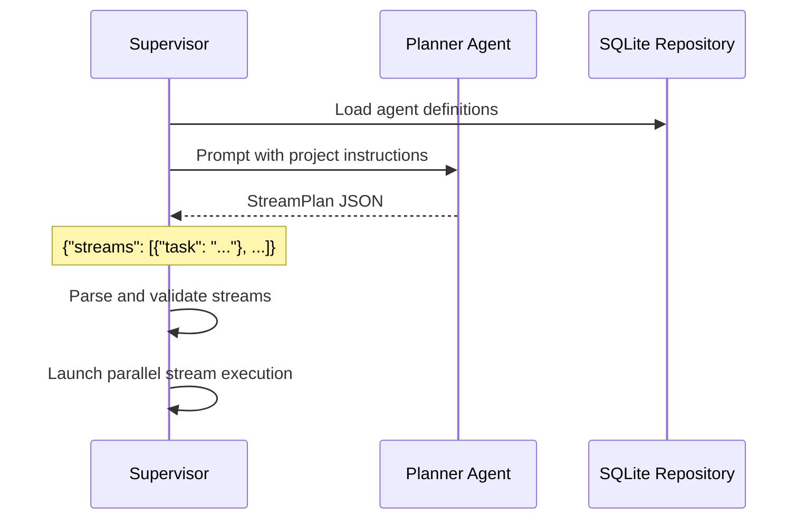
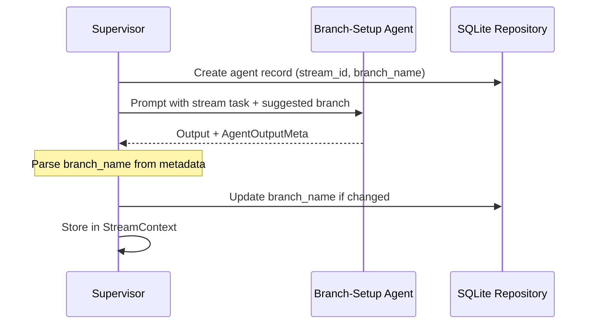
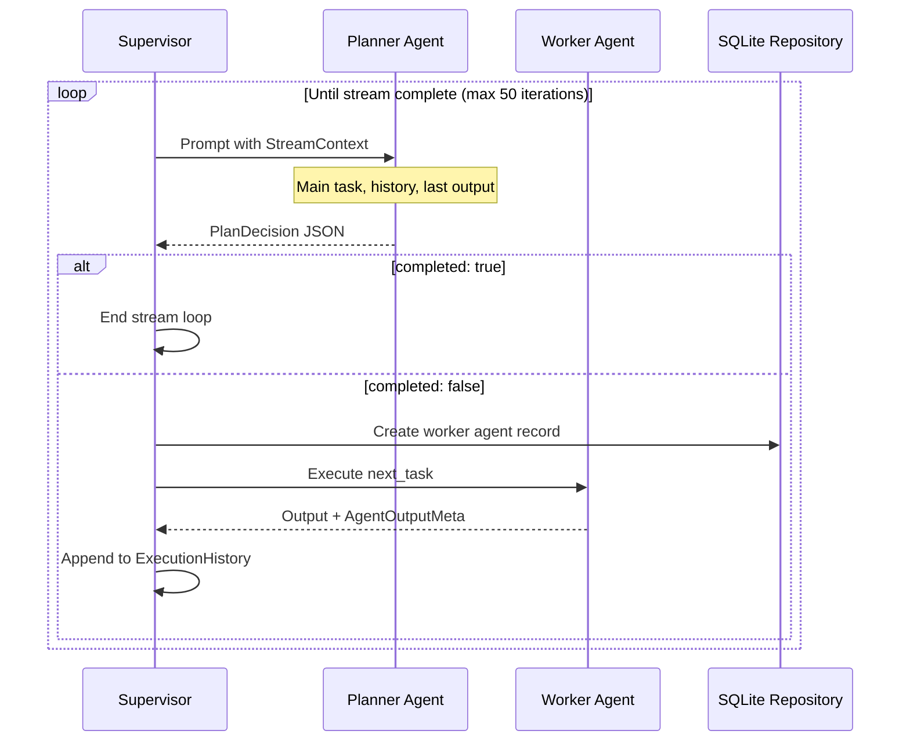
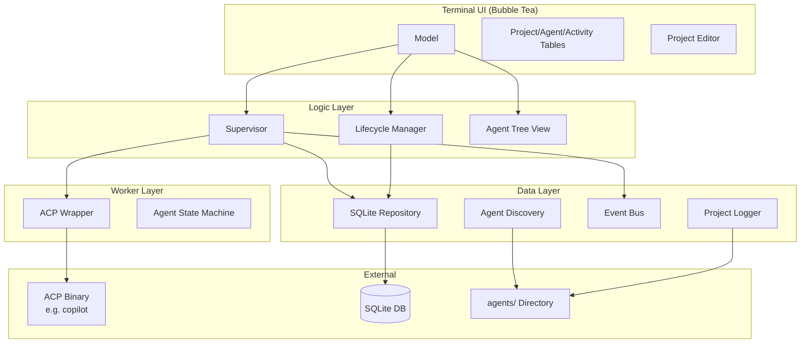
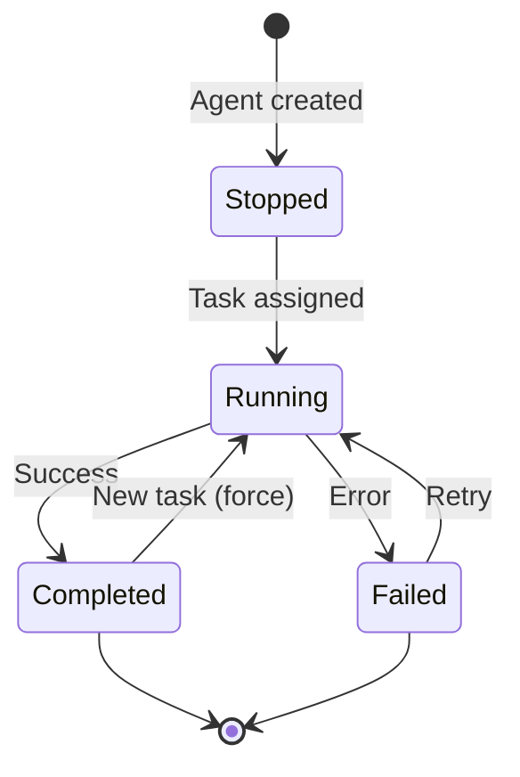
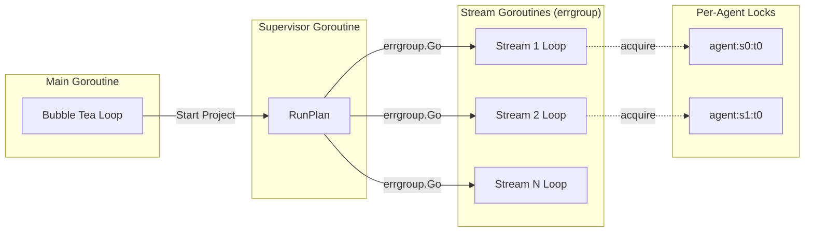

# Kennel

Kennel is a terminal-based framework for orchestrating AI agents. It provides a
TUI (Terminal User Interface) that lets you configure projects, assign agents to
them and watch the agents work through a planned set of tasks in real time.

## Overview

Kennel uses the [Agent Control Protocol (ACP)](https://github.com/coder/acp-go-sdk)
to communicate with AI coding agents. When a project is started the built-in
supervisor orchestrates work through an **iterative per-stream planning model**:

1. The **planner** agent decomposes project instructions into high-level **streams**
   (independent work tracks).
2. Each stream runs **concurrently** with its own **branch-setup** step to
   initialise an isolated git branch.
3. For each stream, the planner is **re-invoked iteratively** to decide the
   **single next step** (or mark the stream complete).
4. Agents return **structured metadata** so the planner can make informed
   decisions about what to do next.
5. All state changes and activities are persisted to a local SQLite database
   so runs can be resumed after a restart.

## Execution Flow

The following diagram shows the high-level orchestration flow when a project is started:



### Detailed Flow

#### 1. Initial Stream Planning

When `Supervisor.RunPlan()` is called ([`internal/logic/supervisor.go:167`](internal/logic/supervisor.go#L167)):



The planner receives a prompt like:

```
Create a JSON object containing a "streams" array.
Each item in "streams" must be an object with a single "task" string
describing one independent high-level work stream.

Instructions: <user instructions>
Available agents: backend-developer, frontend-developer, tester, ...

Return only JSON or a Markdown JSON block.
```

#### 2. Per-Stream Branch Setup

Each stream begins with branch initialisation ([`internal/logic/supervisor.go:659`](internal/logic/supervisor.go#L659)):



#### 3. Iterative Task Planning

The planner is re-invoked for each step ([`internal/logic/supervisor.go:618`](internal/logic/supervisor.go#L618)):



The planner decision prompt includes:

```
Main task: <stream goal>
Stream id: <index>
Stream branch: <branch_name>
Execution history:
1. [branch-setup] Initialize branch => Branch created
2. [backend-developer] Build API => API endpoints implemented

Last agent: backend-developer
Last agent task: Build API
Last agent summary: API endpoints implemented
Last agent output: <full output>

Available agents: backend-developer, frontend-developer, tester, ...

Return JSON:
{"completed": false, "reason": "...", "next_task": {"agent": "...", "task": "..."}}
or
{"completed": true, "reason": "..."}
```

## Data Flow and Contracts

### StreamPlan (Initial Planning Output)

```json
{
  "streams": [
    {"task": "Implement backend API for jokes endpoint"},
    {"task": "Build React frontend with joke display"}
  ]
}
```

Reference: [`StreamPlan` struct](internal/logic/supervisor.go#L38-L40)

### PlanDecision (Per-Step Planning Output)

```json
{
  "completed": false,
  "reason": "Backend API is ready, now need to build the frontend",
  "next_task": {
    "agent": "frontend-developer",
    "task": "Create React component to display and cycle through jokes"
  }
}
```

Reference: [`PlanDecision` struct](internal/logic/supervisor.go#L42-L46)

### AgentOutputMeta (Worker Output)

Every worker agent must end its response with a JSON metadata block:

```json
{
  "summary": "Created JokesController with GET /api/jokes endpoint",
  "branch_name": "feature/jokes-api",
  "files_modified": ["Controllers/JokesController.cs", "Program.cs"],
  "tests_run": {
    "passed": 5,
    "failed": 0,
    "skipped": 0,
    "failures": []
  },
  "issues": [],
  "recommendations": ["Consider adding pagination for large joke sets"],
  "completion_status": "full"
}
```

Reference: [`AgentOutputMeta` struct](internal/logic/agent_output.go#L10-L18)

### StreamContext (Planner Input)

The supervisor builds context for planner decisions:

```go
type StreamContext struct {
    StreamID         int            // Stream index
    MainTask         string         // Original stream goal
    BranchName       string         // Git branch for this stream
    ExecutionHistory []ExecutedStep // All completed steps
    PlannerOutputs   []string       // Raw planner outputs
}
```

Reference: [`StreamContext` struct](internal/logic/supervisor.go#L70-L76)

## Component Architecture



### Key Components

| Component | Location | Responsibility |
|-----------|----------|----------------|
| `Supervisor` | [`internal/logic/supervisor.go`](internal/logic/supervisor.go) | Orchestrates planning and execution |
| `ACPWrapper` | [`internal/workers/acp.go`](internal/workers/acp.go) | Manages ACP binary lifecycle and prompts |
| `SQLiteRepository` | [`internal/data/repository.go`](internal/data/repository.go) | Persists projects, agents, activities |
| `AgentDefinition` | [`internal/data/discovery.go`](internal/data/discovery.go) | Loads agent configs from `agents/` |
| `EventBus` | [`internal/data/eventbus.go`](internal/data/eventbus.go) | Publishes agent/supervisor events |
| `Model` | [`internal/logic/model.go`](internal/logic/model.go) | Bubble Tea TUI state management |

## Agent Execution Lifecycle



Each agent transition is:
1. Persisted to SQLite ([`UpdateAgentState`](internal/data/repository.go#L328))
2. Published via EventBus ([`publishSync`](internal/logic/supervisor.go#L1003))
3. Reflected in the TUI tables

## Concurrency Model



- Streams execute in parallel via [`errgroup`](https://pkg.go.dev/golang.org/x/sync/errgroup)
- Each agent task acquires a lock keyed by instance (`s{stream}:t{step}`)
- The planner can run concurrently across streams (each gets its own instance)
- SQLite is configured with `MaxOpenConns(1)` for serialised writes

## Architecture

```
agents/              – Agent definitions (one directory per agent with instructions.md)
cmd/app/             – Application entry point (Bubble Tea TUI)
data/                – Runtime data directory containing `kennel.db` (projects, agents, activities)
internal/
  data/              – SQLite repository, agent discovery, event bus, and logging
  logic/             – TUI model, supervisor orchestration, lifecycle, editor, activity tracking
  ui/                – Terminal styles
  ui/table/          – Custom table widget with keyboard navigation
  workers/           – ACP SDK wrapper and agent state machine
```

## Prerequisites

- **Go 1.26+**
- An ACP-compatible agent binary (the default configuration expects a `copilot`
   binary on `PATH` — see `agents/default.json`).

## Getting Started

```bash
# Clone the repository
git clone https://github.com/MattiasHognas/Kennel.git
cd Kennel

# Build the application
go build -o kennel ./cmd/app

# Run
./kennel
```

On first launch a sample project is seeded into the local SQLite database
(`data/kennel.db`). Use the TUI to edit the project name, workplace path, and
instructions before starting it.

## Usage

### Keyboard shortcuts

| Key              | Action                                      |
|------------------|---------------------------------------------|
| `tab` / `→`      | Move focus to the next table                |
| `shift+tab` / `←`| Move focus to the previous table             |
| `enter`          | Edit the selected project                   |
| `space`          | Cycle the selected project/agent state      |
| `s`              | Start the selected project or agent         |
| `p`              | Stop the selected project or agent          |
| `esc` / `q`      | Quit                                        |

### Project editor

Press `enter` on a project row to open the editor. Fill in the **Name**,
**Workplace** (absolute path to the target repository) and **Instructions**,
then tab to `[ OK ]` and press `enter` to save.

## Agents

Agents are discovered from the `agents/` directory at the location of the
executable. Each agent is a sub-directory containing an `instructions.md` file.
An optional `agent.json` can override the default launch configuration and
declare per-agent MCP servers and visibility rules. The global `agents/default.json`
uses the same schema and provides defaults for every agent.

### Pre-configured agents

| Agent               | Role                                         |
|---------------------|----------------------------------------------|
| `branch-setup`      | Creates/checks out project branches          |
| `planner`           | Decomposes instructions into an execution plan |
| `backend-developer` | Implements backend features, APIs, data models |
| `frontend-developer`| Implements frontend features and components  |
| `code-reviewer`     | Reviews and validates code changes           |
| `tester`            | Creates and runs test suites                 |
| `devops`            | Manages build scripts, CI/CD, deployment     |
| `docs-writer`       | Creates and updates documentation            |

### Plan view

Discovery stays flat on disk under `agents/`, but the TUI renders the working
plan from the planner's existing `streams` output. `planner` and
`branch-setup` stay visible as standalone rows, while planned work is grouped
under stream headers.

```text
planner
branch-setup
[-] Stream 1 (2 tasks)
   1. backend-developer - Build API
   2. tester - Run tests
[+] Stream 2 (3 tasks)
```

When the plan table is focused, `enter` toggles the selected stream between
expanded and collapsed states.

### Adding a custom agent

1. Create a new directory under `agents/`, e.g. `agents/my-agent/`.
2. Add an `instructions.md` with the agent's system prompt.
3. Optionally add an `agent.json` to override the launch binary/args, attach
    MCP servers, or restrict prompt and git visibility.

Each `agent.json` can override `binary`, `args`, and `env` independently from
`agents/default.json`, so one agent can use a different ACP-compatible runtime
without affecting the rest.

### Agent configuration schema

`agents/default.json` and `agents/<name>/agent.json` share the same flat JSON
shape. Existing `binary`, `args`, and `env` fields still work.

```json
{
   "binary": "copilot",
   "args": ["--acp"],
   "env": {
      "COPILOT_LOG_LEVEL": "debug"
   },
   "promptContext": {
      "previousOutput": true
   },
   "permissions": {
      "git": {
         "status": true,
         "diff": true,
         "history": true
      },
      "acp": {
         "readTextFile": true,
         "writeTextFile": true,
         "requestPermission": true,
         "createTerminal": true,
         "killTerminal": true,
         "terminalOutput": true,
         "releaseTerminal": true,
         "waitForTerminal": true
      }
   },
   "mcpServers": [
      {
         "transport": "stdio",
         "name": "playwright",
         "command": "npx",
         "args": ["@playwright/mcp@latest"]
      }
   ]
}
```

`promptContext.previousOutput` controls whether the supervisor includes the
previous agent's output in the next task prompt.

`permissions.git` controls ACP tool access to git metadata:

- `status`: allows `git status`
- `diff`: allows `git diff`
- `history`: allows history-style commands such as `git log`, `git show`, and direct `.git` reads

`permissions.acp` controls which ACP methods the agent can call at all:

- `readTextFile`: allows workspace file reads
- `writeTextFile`: allows workspace file writes
- `requestPermission`: allows approval requests
- `createTerminal`: allows starting terminal commands
- `killTerminal`: allows terminating a tracked terminal
- `terminalOutput`: allows reading tracked terminal output
- `releaseTerminal`: allows dropping a tracked terminal handle
- `waitForTerminal`: allows waiting for terminal completion

`mcpServers` supports these transports:

- `stdio`: requires `name` and `command`; optional `args` and `env`
- `http`: requires `name` and `url`; optional `headers`
- `sse`: requires `name` and `url`; optional `headers`

### Example: isolate the tester

```json
{
   "promptContext": {
      "previousOutput": false
   },
   "permissions": {
      "git": {
         "status": false,
         "diff": false,
         "history": false
      }
   }
}
```

### Example: planner with no ACP tool access

```json
{
   "binary": "copilot",
   "args": ["--acp"],
   "promptContext": {
      "previousOutput": false
   },
   "permissions": {
      "git": {
         "status": false,
         "diff": false,
         "history": false
      },
      "acp": {
         "readTextFile": false,
         "writeTextFile": false,
         "requestPermission": false,
         "createTerminal": false,
         "killTerminal": false,
         "terminalOutput": false,
         "releaseTerminal": false,
         "waitForTerminal": false
      }
   }
}
```

### Example: frontend agent with Playwright MCP

```json
{
   "mcpServers": [
      {
         "transport": "stdio",
         "name": "context7",
         "command": "npx",
         "args": ["-y", "@upstash/context7-mcp"]
      },
      {
         "transport": "stdio",
         "name": "playwright",
         "command": "npx",
         "args": ["@playwright/mcp@latest"]
      }
   ]
}
```

### Suggested MCP pairings

- `backend-developer`: add a docs-oriented MCP such as `context7` for .NET and ASP.NET Core references
- `frontend-developer`: combine `context7` for React docs with `playwright` for browser verification
- `tester`: keep `playwright` for UI and E2E validation; add API-specific tooling only if the target stack has one
- `code-reviewer`: usually no extra MCP is needed beyond repo access; if added, prefer read-focused docs/search tooling over execution-heavy tooling
- `docs-writer`: `context7` is useful for pulling framework and library reference material while writing docs
- `devops`: consider Docker, Kubernetes, Terraform, or cloud-provider MCPs only if those runtimes are already standard in your projects
- `branch-setup`: avoid extra MCPs unless you want issue-tracker or ticket-system integration
- `planner`: keep isolated unless you explicitly want it to reason over external specs or trackers

## Development

### Build

```bash
go build ./cmd/app
```

### Run tests

```bash
go test ./...
```

### Code coverage

```bash
go test -coverprofile=coverage.out ./...
go tool cover -html=coverage.out
```

### Debugging

VS Code launch configurations are included in `.vscode/launch.json` for
debugging with `dlv-dap`.

## Roadmap

- Configure guardrails for agent actions
- Declare and restrict tool usage per agent
- Configurable feedback loops between agents
- Real-time visualisation of feedback and evaluation results
- Automatic creation and destruction of agents based on project needs

## License

[MIT](LICENSE) — Copyright © 2026 Mattias Högnäs